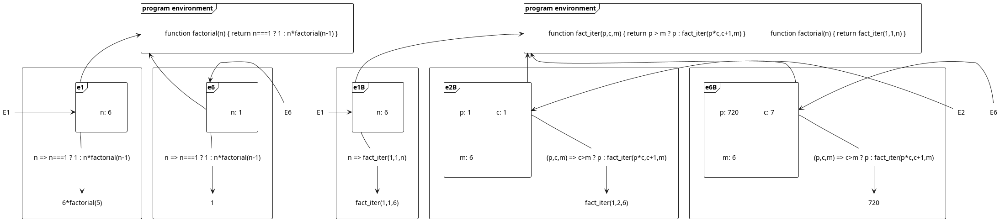

# 3.9

Here the evaluation of two versions of the factorial function is shown using the environment model of evaluation.

```js
function factorial(n) {
  return n===1 ? 1 : n*factorial(n-1)
}
```

```js
function factorial(n) { return fact_iter(1,1,n) }
function fact_iter(p,c,m) { return p > m ? p : fact_iter(p*c,c+1,m) }
```

The e's describe the sub-environments in which the expression forming the bodies of the functions are evaluated. Please, note that only the relevant environments are shown.


